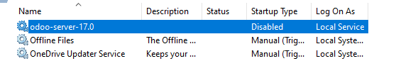

# Welcome to My Tech Blog

## Developing Odoo
#### Odoo configuration
Inside the odoo `odoo.conf` configuation file, find the `addons_path` inside there insert the addons folder where the new module is build.


```
[options]
addons_path = c:\server\odoo\addons,c:\server\addons  <- Add this
admin_passwd = 1234
bin_path = C:\thirdparty
csv_internal_sep = ,
data_dir = C:\sessions
db_host = localhost
db_maxconn = 64
db_maxconn_gevent = False
```
## Launch.json
This is essential if you want to restart the Odoo server without every time to restart the odoo service from services.

```
{
    "version": "0.2.0",
    "configurations": [
        {
            "name": "[Company] Odoo",
            "type": "debugpy",
            "python": "C:\\python.exe",
            "request": "launch",
            "program": "${workspaceFolder}/odoo-bin",
            "console": "integratedTerminal",
            "args": [
                "--config=${workspaceRoot}\\odoo.conf",
            ],
            "cwd": "${workspaceRoot}",
            "env": {},
            "envFile": "${workspaceFolder}/.env",
        }
    ]
}
```
Once you have configured this, close the Odoo server.
Head over to system > services and disable the odoo-server-X service from Windows.


## Stay Tuned!


